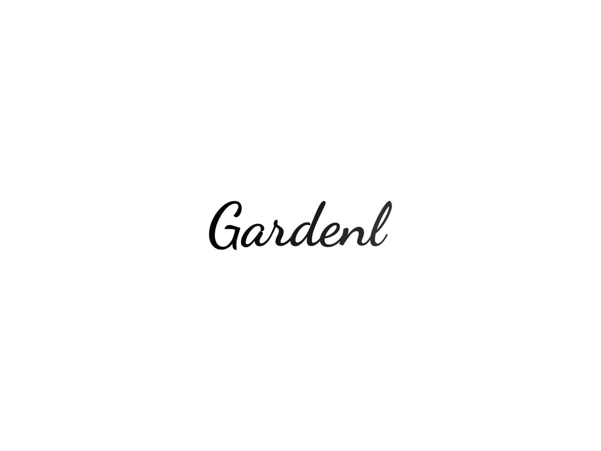

# Description

## 🇫🇷
Les maraichers sont confrontés à des problèmes d'organisation, le but de ce projet à été de concevoir une ébauche d'un outil permettant de rendre la vie des maraichers plus simple. Cet outil de planification permet d'optimiser ces planches (champs ou Serres) en fonction de plusieurs règles basiques.

## 🇺🇸
The market gardeners are confronted with organizational problems, the goal of this project was to design a draft of a tool to make the life of the market gardeners easier. This planning tool allows to optimize these planks (fields or greenhouses) according to several basic rules.

You can find a [demo here](https://hectar-agrihack.herokuapp.com/)

# Rules

## 🇫🇷
  - Succéder selon période semis / récolte et durée en champs 
  - Serre ou Plein Champs -> les variétés de pleins champs peuvent aller en serre mais les variétés en serres ne peuvent pas aller en plein champ
  - Ne pas mettre 2 fois la même famille sur une planche
  - Alterner fertilisation forte puis moyenne puis faible (une fertilisation forte peut suivre une fertilisation faible)

## 🇺🇸
  - Succeed according to sowing / harvesting period and duration in the field 
  - Greenhouse or field -> field varieties can go into the greenhouse but greenhouse varieties cannot go into the field
  - Do not put the same family twice on a plank
  - Alternate strong fertilization then medium then weak (A strong fertilization can follow a weak fertilization)

# Screenshots

## Without optimisation

## With optimisation

